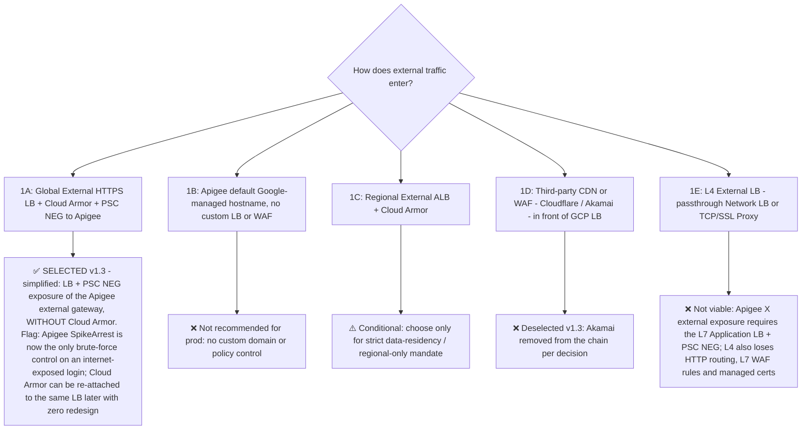
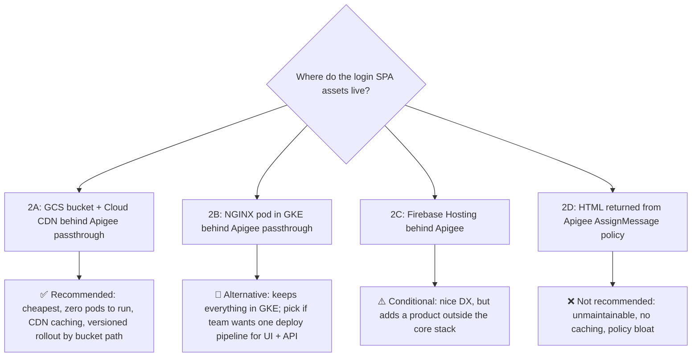
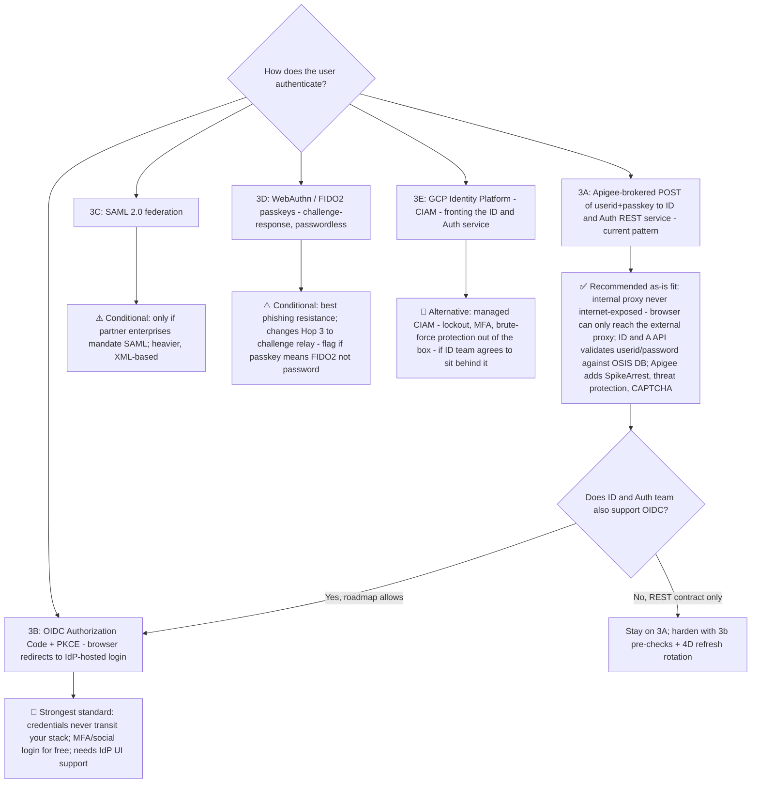
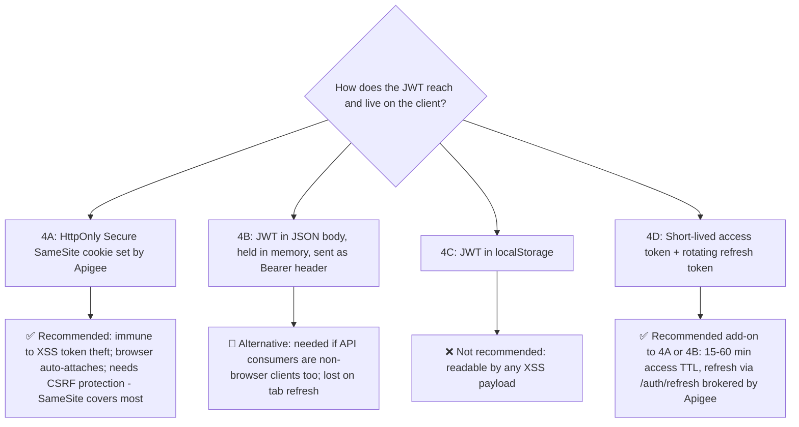
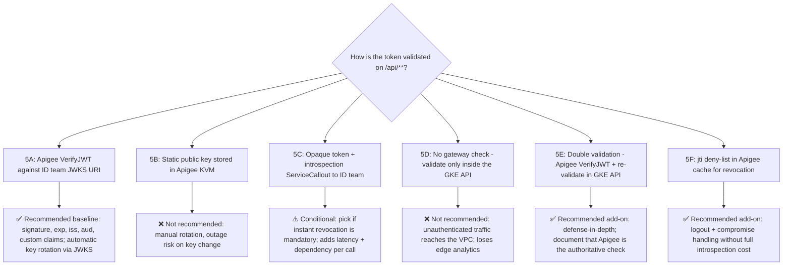
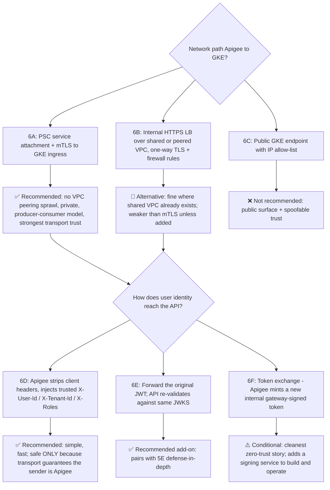
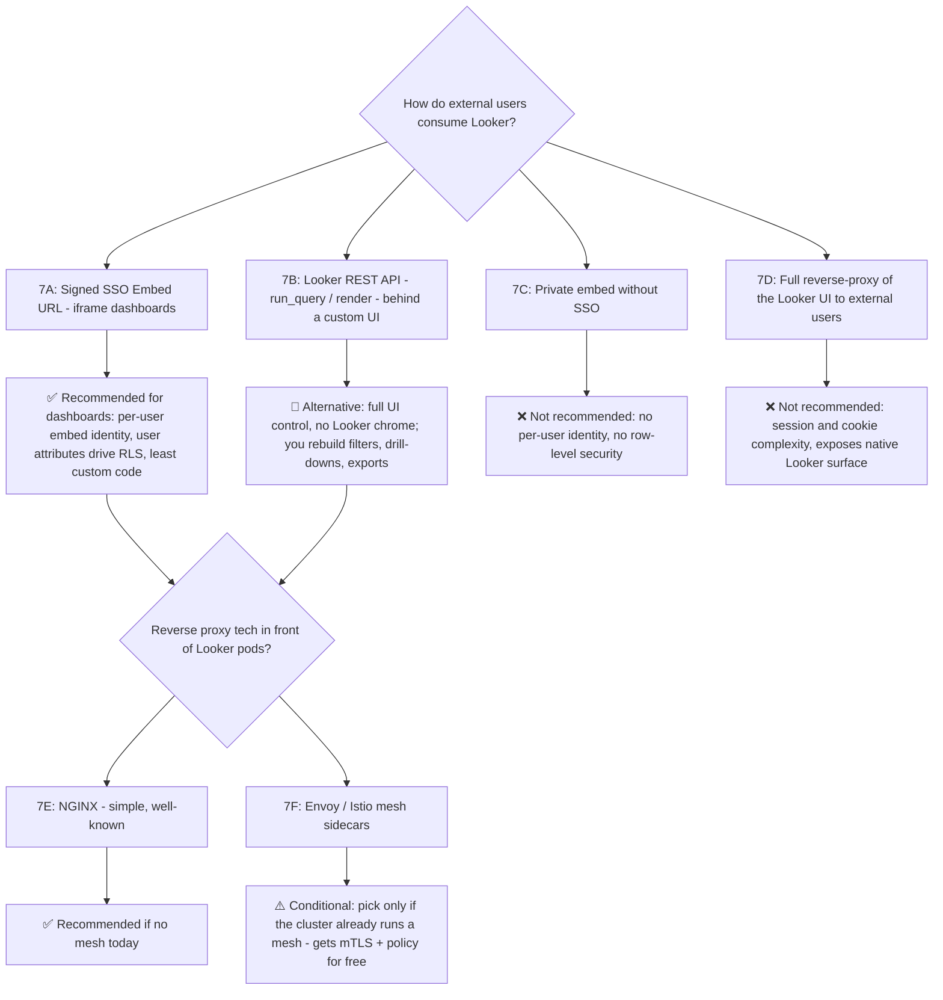
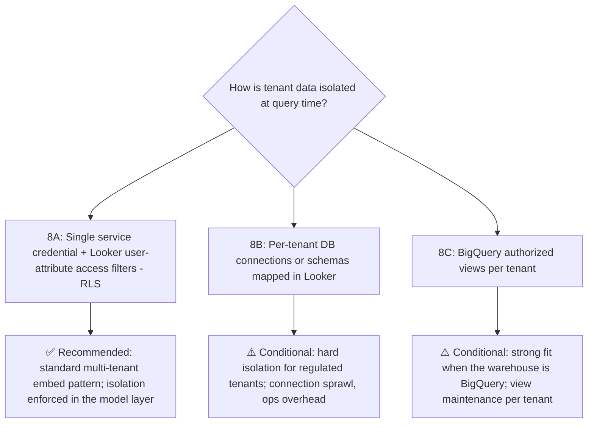

# Decision Trees — External User Access to Looker on GKE (Hop-by-Hop Options)

Companion to the architecture document. Each hop of the flow has a decision tree showing **all viable connectivity/auth options**, with the recommended path marked. Option IDs (1A, 3B, 6D…) match the Excel decision matrix (`looker-external-access-decision-matrix.xlsx`) so both artifacts can be reviewed side-by-side with the central architect team.

Legend: ✅ Recommended · 🔁 Alternative · ⚠️ Conditional (needs a stated driver) · ❌ Not recommended

---

## Master Map — where each decision sits in the flow

```mermaid
flowchart TD
    U["External User Browser"] --> D1{"D1: Internet entry point?"}
    D1 --> H1["Hop 1: Edge - LB + Cloud Armor"]
    H1 --> D2{"D2: Where is the Login UI hosted / served?"}
    D2 --> H2["Hop 2: Apigee UI passthrough"]
    H2 --> D3{"D3: How are credentials authenticated?"}
    D3 --> H3["Hop 3: Auth broker to ID and Auth team"]
    H3 --> D4{"D4: How is the token delivered and stored?"}
    D4 --> H4["Hop 4: Token on client"]
    H4 --> D5{"D5: How is the JWT validated?"}
    D5 --> H5["Hop 5: Apigee data proxy"]
    H5 --> D6{"D6: Southbound trust and identity propagation?"}
    D6 --> H6["Hop 6: Apigee to GKE API"]
    H6 --> D7{"D7: How is Looker consumed?"}
    D7 --> H7["Hop 7: GKE API to Looker"]
    H7 --> D8{"D8: How does Looker isolate tenant data?"}
    D8 --> H8["Hop 8: Looker to DB"]
```

---

## D1 — Hop 1: User → Internet Entry Point

**Key question for the architect team:** decided — direct Apigee external gateway exposure (no Akamai, no Cloud Armor). Remaining check: agree the abuse-control budget on `/auth/login` (SpikeArrest per-IP limits, CAPTCHA threshold), since Apigee is now the only line of defense; revisit Cloud Armor if login abuse is observed.

---

## D2 — Hop 2: Edge → Login UI Hosting & Delivery

**Key question:** does the platform team prefer one GKE pipeline for everything (2B), or minimal-ops static hosting (2A)?

---

## D3 — Hop 3: Credential Authentication (the biggest decision)

**Key questions:** (1) Is "passkey" a password or a FIDO2 passkey? (2) Can the ID & Auth team expose OIDC, or is the REST+JWT JSON contract fixed?

---

## D4 — Hop 4: Token Delivery & Client-Side Storage

---

## D5 — Hop 5: JWT Validation at the Gateway

**Key question:** what is the revocation SLA? If "seconds", 5C introspection wins; if "token TTL is acceptable", 5A + 5F wins.

---

## D6 — Hop 6: Southbound Trust (Apigee → GKE) & Identity Propagation

---

## D7 — Hop 7: GKE API → Looker Consumption Model

**Key question:** do users need the Looker look-and-feel (7A) or a fully branded custom experience (7B)? This drives months of effort difference.

---

## D8 — Hop 8: Looker → Database Tenant Isolation

---

## Recommended Golden Path (one line)

**1A-lite (LB + PSC exposure, no Cloud Armor — flagged) → 2A → 3A via internal-proxy chain to ID&A API + OSIS DB (evolve to 3B) → 4A + 4D → 5A + 5E + 5F → 6A + 6D + 6E → 7A + 7E → 8A**

Every ✅ above composes into this path; every ⚠️ has a named driver the architect team must confirm before selecting it. D1 is decided (direct Apigee exposure, edge WAF removed — SpikeArrest is the only abuse control, flagged); D3's transport is decided (proxy chain to the internal proxy, credentials validated against OSIS).
